# SportHawk Database Schema

## Mermaid Diagram

```mermaid
erDiagram
    clubs {
        uuid id PK
        string slug UK
        string name
        string location_city
        string location_country
        uuid created_by FK
        boolean is_active
    }

    teams {
        uuid id PK
        uuid club_id FK
        string name UK
        string sport
        boolean is_active
    }

    profiles {
        uuid id PK
    }

    club_admins {
        uuid id PK
        uuid club_id FK
        uuid user_id FK
    }

    club_members {
        uuid club_id PK,FK
        uuid user_id PK,FK
    }

    team_admins {
        uuid id PK
        uuid team_id FK
        uuid user_id FK
    }

    team_members {
        uuid id PK
        uuid team_id FK
        uuid user_id FK
        integer jersey_number
        string member_status
    }

    team_invitations {
        uuid id PK
        uuid team_id FK
        uuid club_id FK
        string token UK
        string email
        string status
    }

    events {
        uuid id PK
        uuid team_id FK
        date event_date
        string event_status
        string event_type
    }

    event_participants {
        uuid id PK
        uuid event_id FK
        uuid user_id FK
        string attendance_status
    }

    event_availability {
        uuid id PK
        uuid event_id FK
        uuid user_id FK
    }

    event_invitations {
        uuid id PK
        uuid event_id FK
        uuid user_id FK
    }

    event_squads {
        uuid id PK
        uuid event_id FK
        uuid user_id FK
    }

    event_locations {
        uuid id PK
        uuid team_id FK
        string name
    }

    payment_requests {
        uuid id PK
        uuid team_id FK
        date due_date
        string request_status
    }

    payment_request_members {
        uuid id PK
        uuid payment_request_id FK
        uuid user_id FK
        string payment_status
    }

    payment_request_users {
        uuid id PK
        uuid payment_request_id FK
        uuid user_id FK
        string status
    }

    payments {
        uuid id PK
        uuid payment_request_id FK
        uuid user_id FK
        string status
    }

    payment_reminders {
        uuid id PK
        uuid payment_request_id FK
        uuid user_id FK
    }

    payment_transactions {
        uuid id PK
        uuid payment_request_member_id FK
        string stripe_payment_intent_id UK
    }

    stripe_accounts {
        uuid id PK
        uuid team_id FK
        string stripe_account_id UK
    }

    broadcast_messages {
        uuid id PK
        uuid club_id FK
        uuid team_id FK
    }

    notifications {
        uuid id PK
        uuid user_id FK
        boolean is_read
        string notification_type
        timestamp created_at
    }

    notification_preferences {
        uuid id PK
        uuid user_id FK
        uuid team_id FK
        string notification_type
    }

    notification_queue {
        uuid id PK
        uuid user_id FK
        uuid template_id FK
        string status
        timestamp scheduled_for
    }

    notification_templates {
        uuid id PK
        string trigger UK
    }

    push_tokens {
        uuid id PK
        uuid user_id FK
        string token UK
        string device_id
        boolean is_active
    }

    device_tokens {
        uuid id PK
        uuid user_id FK
        string device_id
        boolean is_active
    }

    interest_expressions {
        uuid id PK
        uuid team_id FK
        uuid user_id FK
    }

    club_search_index {
        uuid id PK
        uuid club_id FK
    }

    admin_logs {
        uuid id PK
        uuid admin_user_id FK
        uuid target_user_id FK
    }

    %% Relationships
    teams ||--o{ club_id : belongs_to
    club_admins ||--o{ clubs : manages
    club_members ||--o{ clubs : member_of
    team_admins ||--o{ teams : manages
    team_members ||--o{ teams : member_of
    team_invitations ||--o{ teams : invites_to
    team_invitations ||--o{ clubs : associated_with
    events ||--o{ teams : scheduled_for
    event_participants ||--o{ events : participates_in
    event_availability ||--o{ events : available_for
    event_invitations ||--o{ events : invited_to
    event_squads ||--o{ events : selected_for
    event_locations ||--o{ teams : venue_for
    payment_requests ||--o{ teams : billed_to
    payment_request_members ||--o{ payment_requests : pays_for
    payment_request_users ||--o{ payment_requests : owes
    payments ||--o{ payment_requests : settles
    payment_reminders ||--o{ payment_requests : reminds_about
    payment_transactions ||--o{ payment_request_members : transaction_for
    stripe_accounts ||--o{ teams : processes_payments_for
    broadcast_messages ||--o{ clubs : sent_to_club
    broadcast_messages ||--o{ teams : sent_to_team
    notification_preferences ||--o{ teams : preferences_for
    notification_queue ||--o{ notification_templates : uses_template
    interest_expressions ||--o{ teams : interested_in
    club_search_index ||--o{ clubs : indexes
```

## Key Relationships Summary

### Club Structure

- **clubs** → **teams**: One club can have multiple teams
- **clubs** → **club_admins**: Clubs have administrators
- **clubs** → **club_members**: Clubs have members

### Team Structure

- **teams** → **team_admins**: Teams have administrators
- **teams** → **team_members**: Teams have members
- **teams** → **team_invitations**: Teams can send invitations

### Event Management

- **teams** → **events**: Teams schedule events
- **events** → **event_participants**: Events have participants
- **events** → **event_availability**: Tracks member availability
- **events** → **event_invitations**: Events can have invitations
- **events** → **event_squads**: Selected squad for events

### Payment System

- **teams** → **payment_requests**: Teams create payment requests
- **payment_requests** → **payment_request_members**: Individual member payment records
- **payment_requests** → **payments**: Payment transactions
- **payment_request_members** → **payment_transactions**: Stripe payment details
- **teams** → **stripe_accounts**: Stripe integration for teams

### Communication

- **clubs/teams** → **broadcast_messages**: Messages to clubs or teams
- **users** → **notifications**: User notifications
- **teams** → **notification_preferences**: User preferences per team
- **users** → **push_tokens/device_tokens**: Push notification tokens

## Notes

- All primary keys are UUIDs
- User relationships reference auth.users table (not shown)
- Tables use soft deletes with status/is_active fields
- Extensive indexing on foreign keys and commonly queried fields
