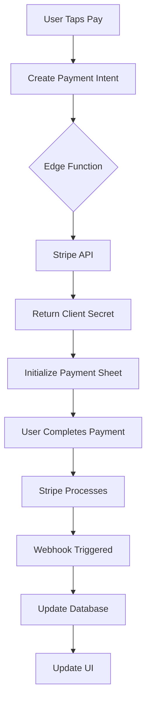

# PAY-005 Development & Testing Guide

**Purpose:** Complete preparation checklist and guide to ensure smooth development and testing of Stripe payment integration.  
**Story:** PAY-005 - Pay Payment Request (Member)  
**Last Updated:** 2025-01-07

## 🚦 Pre-Development Checklist

### 1. Environment Setup Verification

```bash
# Run this script to verify your environment is ready
echo "🔍 Checking PAY-005 Development Environment..."

# 1. Check Node version (should be 18+)
node -v

# 2. Check Expo CLI
expo --version

# 3. Check Supabase CLI
supabase --version

# 4. Check for required environment variables
if [ -z "$EXPO_PUBLIC_STRIPE_PUBLISHABLE_KEY" ]; then
  echo "❌ Missing EXPO_PUBLIC_STRIPE_PUBLISHABLE_KEY"
else
  echo "✅ Stripe publishable key found"
fi

# 5. Check Supabase connection
npx supabase status

# 6. Verify Edge Functions are deployed
npx supabase functions list | grep stripe

echo "✅ Environment check complete"
```

### 2. Required Access & Credentials

- [ ] **Stripe Dashboard Access** (Test mode)
  - URL: https://dashboard.stripe.com/test
  - Need: View payments, webhooks, logs
- [ ] **Supabase Dashboard Access**
  - Project: vwqfwehtjnjenzrhzgol
  - Need: View logs, run SQL, check Edge Functions
- [ ] **GitHub Repo Access**
  - Need: Create branches, PRs
- [ ] **Figma Access**
  - Node: 559-3055
  - Need: View payment detail designs

### 3. Dependencies Installation

```bash
# Ensure all dependencies are installed
npm install @stripe/stripe-react-native

# iOS specific
cd ios && pod install && cd ..

# Verify installation
npm list @stripe/stripe-react-native
```

## 🗃️ Test Data Setup Guide

### Create Complete Test Scenario

```sql
-- Run in Supabase SQL Editor to create test payment scenario
-- This creates a complete payment request with member assignments

-- 1. Create a test payment request
INSERT INTO payment_requests (
  id,
  team_id,
  title,
  description,
  amount_pence,
  due_date,
  payment_type,
  status,
  created_by
) VALUES (
  'test-pr-001',
  '[YOUR_TEAM_ID]',  -- Replace with actual team_id
  'Test Match Fees',
  'Payment for upcoming match on Saturday',
  2500,  -- £25.00
  NOW() + INTERVAL '7 days',
  'required',
  'active',
  '[YOUR_USER_ID]'  -- Replace with actual user_id
);

-- 2. Assign payment to test members
INSERT INTO payment_request_members (
  id,
  payment_request_id,
  user_id,
  amount_pence,
  payment_status,
  payment_due_date
) VALUES
  ('test-prm-001', 'test-pr-001', '[USER_ID_1]', 2500, 'pending', NOW() + INTERVAL '7 days'),
  ('test-prm-002', 'test-pr-001', '[USER_ID_2]', 2500, 'pending', NOW() + INTERVAL '7 days'),
  ('test-prm-003', 'test-pr-001', '[USER_ID_3]', 2500, 'paid', NOW() + INTERVAL '7 days');  -- One already paid

-- 3. Verify test data
SELECT
  pr.title,
  prm.id as member_payment_id,
  prm.payment_status,
  prm.amount_pence,
  u.full_name
FROM payment_requests pr
JOIN payment_request_members prm ON pr.id = prm.payment_request_id
LEFT JOIN users u ON prm.user_id = u.id
WHERE pr.id = 'test-pr-001';
```

### Clean Up Test Data

```sql
-- Run after testing to clean up
DELETE FROM payment_transactions WHERE payment_request_member_id IN
  (SELECT id FROM payment_request_members WHERE payment_request_id = 'test-pr-001');
DELETE FROM payment_request_members WHERE payment_request_id = 'test-pr-001';
DELETE FROM payment_requests WHERE id = 'test-pr-001';
```

## 📱 Mobile Device Testing Setup

### iOS Testing (Real Device Required)

```bash
# 1. Connect iPhone to Mac
# 2. Trust the computer on your iPhone

# 3. Build for device
expo run:ios --device

# 4. Verify Stripe is initialized
# Look for: "Stripe initialized with publishable key"

# 5. Enable developer mode if needed
# Settings > Privacy & Security > Developer Mode
```

### Android Testing

```bash
# 1. Enable USB debugging on Android device
# Settings > Developer Options > USB Debugging

# 2. Connect device via USB
adb devices  # Should show your device

# 3. Build for device
expo run:android --device

# 4. Grant necessary permissions
# The app may request payment permissions
```

### Testing Without Physical Device

```javascript
// Add to payment screen for development
const DEV_MODE = __DEV__;
const MOCK_PAYMENT = false; // Set to true to bypass Stripe

if (DEV_MODE && MOCK_PAYMENT) {
  // Mock successful payment for development
  const mockPayment = async () => {
    console.log('🔵 [DEV] Mock payment initiated');
    setPaymentStatus(PAYMENT_FLOW_STATUS.PROCESSING);

    // Simulate API delay
    await new Promise(resolve => setTimeout(resolve, 2000));

    setPaymentStatus(PAYMENT_FLOW_STATUS.SUCCESS);
    console.log('✅ [DEV] Mock payment completed');

    // Still update the database
    await paymentApi.updatePaymentStatus(memberPaymentId, 'paid');
  };
}
```

## 🔄 Dependency Flow Map



### Critical Dependencies

1. **Stripe Edge Function** must be deployed
2. **Webhook handler** must be configured
3. **Database RLS policies** must allow updates
4. **Stripe account** must be in test mode
5. **Team must have** stripe_account_id configured

## ⚡ Performance Benchmarks

### Expected Response Times

```typescript
// Add performance monitoring
const performanceMetrics = {
  edgeFunctionCall: 0,
  paymentSheetInit: 0,
  totalFlow: 0,
};

const startTime = Date.now();

// Measure Edge Function
const edgeStart = Date.now();
const { data } = await supabase.functions.invoke('stripe-create-payment');
performanceMetrics.edgeFunctionCall = Date.now() - edgeStart;

// Log if slow
if (performanceMetrics.edgeFunctionCall > 3000) {
  console.warn(
    '⚠️ Slow Edge Function:',
    performanceMetrics.edgeFunctionCall + 'ms'
  );
}

// Expected benchmarks:
// - Edge Function: < 2 seconds
// - Payment Sheet Init: < 1 second
// - Total flow: < 5 seconds
```

## 🚨 Rollback Plan

### If Payment Integration Fails in Production

#### Immediate Actions (< 5 minutes)

```typescript
// 1. Add feature flag to disable payments
const PAYMENTS_ENABLED = false;  // Quick disable

// 2. Show maintenance message
if (!PAYMENTS_ENABLED) {
  return (
    <View style={styles.disabledContainer}>
      <ShText>Payment processing is temporarily unavailable.</ShText>
      <ShText>Please try again later.</ShText>
    </View>
  );
}
```

#### Rollback Steps (< 30 minutes)

```bash
# 1. Revert the deployment
git revert HEAD
git push origin main

# 2. Disable Edge Function
supabase functions delete stripe-create-payment

# 3. Notify team
# Send message to #dev-channel with issue details

# 4. Check for stuck payments
SELECT * FROM payment_request_members
WHERE payment_status = 'processing'
AND updated_at < NOW() - INTERVAL '1 hour';
```

## 🔐 Security Checklist

### Before Going Live

- [ ] **API Keys** - Verify using test keys (pk*test*, sk*test*)
- [ ] **No sensitive data in logs** - Remove all console.log of secrets
- [ ] **HTTPS only** - Ensure all API calls use HTTPS
- [ ] **Input validation** - Amount must be positive integer
- [ ] **User authorization** - Verify user can pay this specific payment
- [ ] **Idempotency** - Prevent duplicate payments
- [ ] **Rate limiting** - Prevent payment spam
- [ ] **Error messages** - Don't expose internal errors to users

### Security Test Cases

```javascript
// Test 1: Negative amount
try {
  await createPayment({ amount_pence: -100 });
  // Should fail
} catch (error) {
  console.assert(error.message.includes('Invalid amount'));
}

// Test 2: Unauthorized payment
try {
  await createPayment({
    payment_request_member_id: 'other-users-payment',
  });
  // Should fail with 403
} catch (error) {
  console.assert(error.status === 403);
}

// Test 3: SQL injection attempt
const maliciousId = "'; DROP TABLE payments; --";
// Should be safely escaped
```

## 📊 Monitoring Setup

### Add Analytics Events

```typescript
// Track payment funnel
import { Analytics } from '@lib/analytics';

// Track each step
Analytics.track('payment_initiated', {
  amount_pence: amountPence,
  payment_type: paymentType,
});

Analytics.track('payment_sheet_opened', {
  payment_intent_id: data.payment_intent_id,
});

Analytics.track('payment_completed', {
  amount_pence: amountPence,
  payment_method: 'card', // or 'apple_pay', 'google_pay'
});

Analytics.track('payment_failed', {
  error_code: error.code,
  error_message: error.message,
});
```

### Database Monitoring Queries

```sql
-- Monitor payment success rate (run daily)
SELECT
  DATE(created_at) as date,
  COUNT(*) as total_attempts,
  COUNT(CASE WHEN payment_status = 'paid' THEN 1 END) as successful,
  ROUND(COUNT(CASE WHEN payment_status = 'paid' THEN 1 END)::numeric / COUNT(*) * 100, 2) as success_rate
FROM payment_request_members
WHERE created_at > NOW() - INTERVAL '7 days'
GROUP BY DATE(created_at)
ORDER BY date DESC;

-- Check for stuck payments
SELECT * FROM payment_request_members
WHERE payment_status = 'processing'
AND updated_at < NOW() - INTERVAL '1 hour';

-- Average payment processing time
SELECT
  AVG(EXTRACT(EPOCH FROM (paid_at - updated_at))) as avg_seconds
FROM payment_request_members
WHERE payment_status = 'paid'
AND paid_at IS NOT NULL;
```

## 👥 Team Communication Plan

### Who to Contact

- **Stripe Issues:** Check Stripe Dashboard first, then #payments-support
- **Database Issues:** Check Supabase logs, then contact DB admin
- **Edge Function Issues:** Check function logs, then backend team
- **UI/UX Issues:** Screenshot and share in #design-feedback
- **Urgent Production Issues:** @here in #dev-emergency

### Status Updates Template

```markdown
**PAY-005 Status Update**

- Environment: [Local/Staging/Production]
- Current Step: [e.g., Testing Edge Function]
- Blockers: [None / Describe issue]
- Next Steps: [What you're doing next]
- ETA: [Completion estimate]
- Need Help With: [Specific assistance needed]
```

## ✅ Final Pre-Launch Checklist

### Development Complete

- [ ] All acceptance criteria met
- [ ] Code reviewed and approved
- [ ] Unit tests passing
- [ ] Integration tests passing
- [ ] No console.log statements with sensitive data

### Testing Complete

- [ ] Tested on iOS device
- [ ] Tested on Android device
- [ ] All test scenarios passed
- [ ] Edge cases handled
- [ ] Performance acceptable

### Documentation Complete

- [ ] Code comments added
- [ ] README updated if needed
- [ ] API documentation current
- [ ] Troubleshooting guide reviewed

### Deployment Ready

- [ ] Environment variables configured
- [ ] Edge Functions deployed
- [ ] Webhooks configured
- [ ] Database migrations run
- [ ] Rollback plan confirmed
- [ ] Monitoring configured
- [ ] Team notified

## 🎯 Success Metrics

### Week 1 Post-Launch

- Payment success rate > 95%
- Average processing time < 5 seconds
- Zero security incidents
- Error rate < 2%
- User complaints < 5

### How to Measure

```sql
-- Run this query after 1 week
SELECT
  'Success Rate' as metric,
  ROUND(COUNT(CASE WHEN payment_status = 'paid' THEN 1 END)::numeric / COUNT(*) * 100, 2) || '%' as value
FROM payment_request_members
WHERE created_at > NOW() - INTERVAL '7 days'
UNION ALL
SELECT
  'Total Payments',
  COUNT(*)::text
FROM payment_request_members
WHERE payment_status = 'paid'
AND created_at > NOW() - INTERVAL '7 days'
UNION ALL
SELECT
  'Total Amount',
  '£' || (SUM(amount_pence) / 100.0)::money::text
FROM payment_request_members
WHERE payment_status = 'paid'
AND created_at > NOW() - INTERVAL '7 days';
```

## 📝 Notes for Future Improvements

### Post-MVP Enhancements

1. **Bulk payments** - Pay multiple requests at once
2. **Recurring payments** - Set up subscriptions
3. **Payment reminders** - Automated notifications
4. **Payment plans** - Split payments over time
5. **Refunds** - Handle refund requests
6. **Reports** - Treasury reports for admins
7. **Receipt emails** - Automatic receipt generation
8. **Multiple currencies** - Support EUR, USD
9. **Direct debit** - Lower transaction fees
10. **Wallet integration** - Save payment methods
